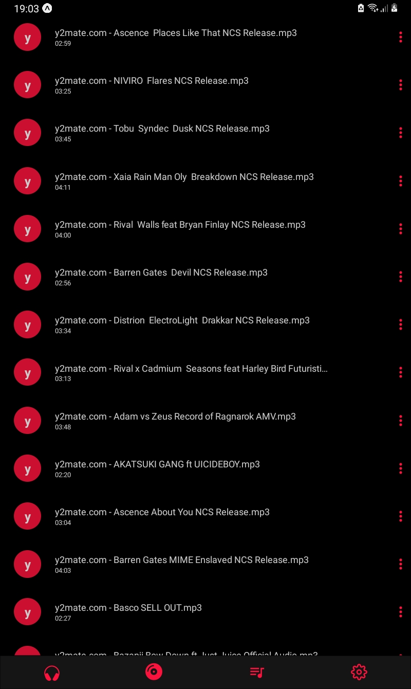

<div align="center" id="top">
  <h3 align="center">Music Player</h3>
  
  <p align="center">
    This app is currently under development
    <br>
    <a href="https://github.com/midnightxd/Mplayer"><strong>Explore the docs »</strong></a>
    <br />
    <br />
    <a href="https://github.com/midnightxd/Mplayer">View Demo</a>
    ·
    <a href="https://github.com/midnightxd/Mplayer/issues">Report Bug</a>
    ·
    <a href="https://github.com/midnightxd/Mplayer/issues">Request Feature</a>
  </p>
</div>

<!-- TABLE OF CONTENTS -->
<details>
  <summary>Table of Contents</summary>
  <ol>
    <li>
      <a href="#about-the-project">About The Project</a>
      <ul>
        <li><a href="#built-with">Built With</a></li>
      </ul>
    </li>
    <li>
      <a href="#getting-started">Getting Started</a>
      <ul>
        <li><a href="#prerequisites">Prerequisites</a></li>
        <li><a href="#installation">Installation</a></li>
      </ul>
    </li>
  </ol>
</details>


<!-- ABOUT THE PROJECT -->
## About The Project

<div align="center" >
  
  
</div>


<p align="right">(<a href="#top">back to top</a>)</p>


### Built With

This section should list any major frameworks/libraries used to bootstrap the project.

* [Expo](https://expo.dev)
* [Expo AV](https://docs.expo.dev/versions/latest/sdk/av/)
* [React Native](https://reactnative.dev)
* [Styled Components](https://styled-components.com)
* [JavaScript](https://www.javascript.com)
* [Node.js](https://nodejs.org/en/)
* [Async Storage](https://react-native-async-storage.github.io/async-storage/docs/usage/)
* [Lottie](https://lottiefiles.com)
<p align="right">(<a href="#top">back to top</a>)</p>

<!-- GETTING STARTED -->
## Getting Started
_Attention as this is still a project in development, just clone the repository._

### Prerequisites

These are the prerequisites for starting the project.
  ```sh
  npm
  ```
  ```sh
  Node.js
  ```
  ```sh
  Expo
  ```


### Installation


1. Clone the repo
   ```sh
   git clone https://github.com/midnightxd/Mplayer.git
   ```
2. Install NPM packages and run project
   ```sh
   cd Mplayer && npm install && npm start
   ```
3. Open the project in your favorite code editor. Example `VS code`
   ```sh
   code .
   ```

<p align="right">(<a href="#top">back to top</a>)</p>
